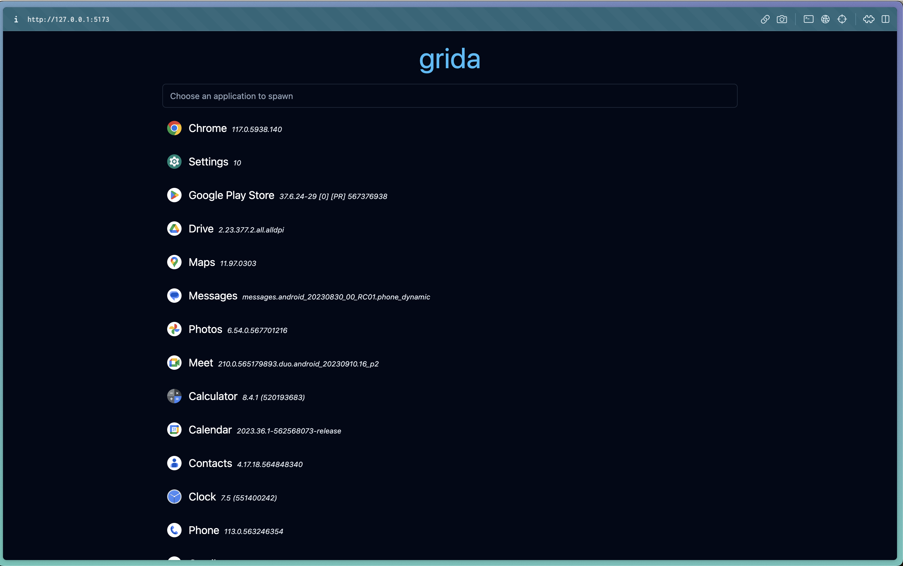
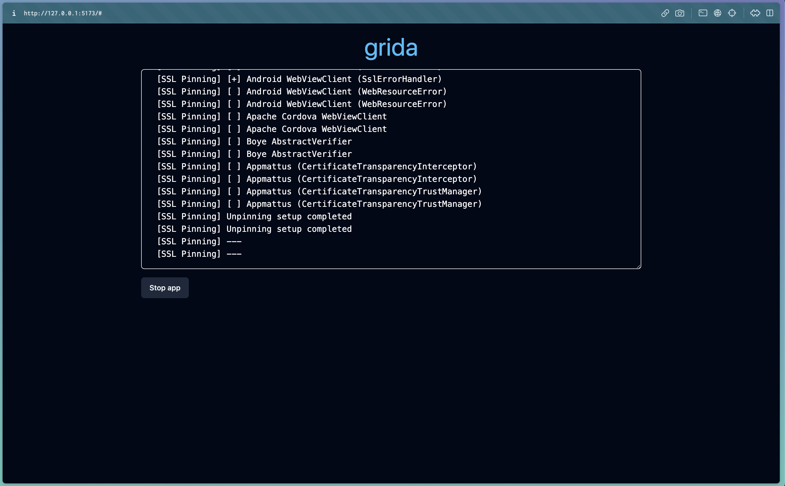

# grida

## What is grida?

User graphical reverse engineering tool for android dynamic instrumentation.

## Features

- [x] SSl pinning bypass
- [x] Mitmweb auto configuration
- [x] Quick APK download and open with JADx

## Installation

### Requirements

You need to have the following tools installed to use fully grida:
- Frida: https://frida.re/docs/installation/
- JADX: https://github.com/skylot/jadx
- Mitmweb: https://mitmproxy.org/

```bash
git clone git@github.com:pluggyai/grida.git
cd grida
npm run install:all
```

## Usage

```bash
npm run dev
```

You will see your apps and you can spawn them and see the logs in the web console.

<div style="display: flex; justify-content: space-between;">
  
  
</div>
